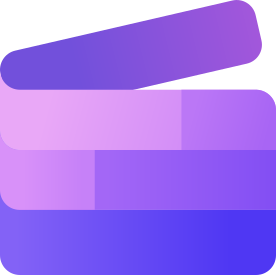

# Hi 🤘

My name is **René _"Havoc"_ Nicolaus**. I'm a Senior Software Engineer / Indie Game Developer.

## 📂 Latest Projects
- [Portals](https://havoc.de/projects.html#portals) - A custom game engine inspired by Doom, currently in development and intended for a future game project
- [havIDE](https://havoc.de/projects.html#havIDE) - An integrated development environment (IDE), currently in development, designed specifically for managing and working on C++ projects

## 📰 Latest News

- 11/19/2025 - [Shadow Knights Development Update: Projects Page Addition and Start of SKE Development](https://havoc.de/articles/2025-11-19.html)
- 11/16/2025 - [Havoc Startup Minimizer Released](https://havoc.de/articles/2025-11-16.html)
- 11/02/2025 - [Shadow Knights Development Update: Controller Support, Save Game Feature, and WinMerge Translation Work](https://havoc.de/articles/2025-11-02.html)
- 10/16/2025 - [Shadow Knights Source Port - Preview Video Released on YouTube](https://havoc.de/articles/2025-10-16.html)
- 10/10/2025 - [Windows Keyboard Layout "IntAltGr" Released](https://havoc.de/articles/2025-10-10.html)

## 📊 Top Languages Across My Public GitHub Repositories
Could not fetch language stats.

## 🧰 Tools & Technologies I Use

### 💻 Languages, Frameworks & Libraries

    
    
    
    
    
    
    
    
    
    
    
    
    
    
    
    
    
    
    
    
    
    

### ☁️ Cloud, DevOps & Backend

    
    
    
    
    
    
    
    

### 🎨 Frontend Styling

    
    
    
    

### 🧰 IDEs & Development Tools

    
    
    
    
    
    
    
    
    

### 🔧 Utilities & Testing

    
    
    
    
    
    
    
    
    
    
    
    

### ⚙️ Operating Systems

    
    

## 📝 Attributions & Legal Notice

Some icons and logos included in this repository are the property of their respective owners. They are used here **for identification and reference purposes only** under their respective open licenses or trademark policies. No affiliation or endorsement is implied.

See [icons/ATTRIBUTIONS.md](icons/ATTRIBUTIONS.md) for full attribution and license details.

---

